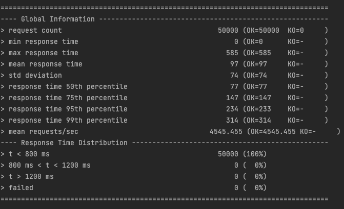
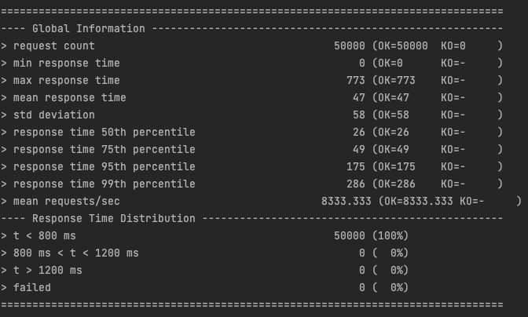
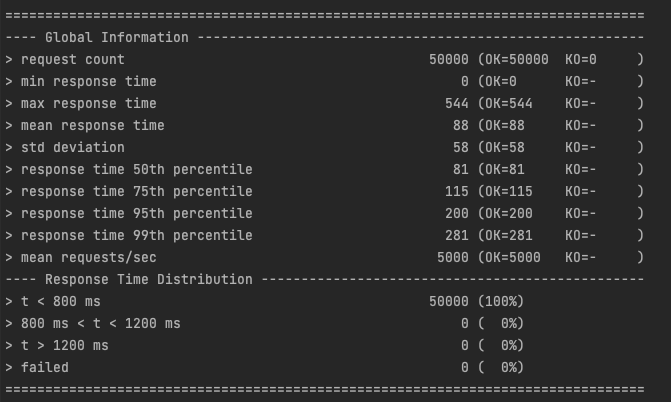

# Geospatial API
A simple RESTful API that allows client to interact with point of interest 
## Summary
- [x] Functional requirement satisfied
  - [x] RESTful api with permanent data store
  - [x] Supports POST, PUT & GET
  - [x] Object contains various primitive attributes
  - [x] PUT respect should not create if POST wasn't executed in advance
- [x] Non-Functional requirement satisfied
  - [x] Average load:
    - [x] 1000 POST/PUT
    - [x] 2000 GET
  - [x] Spike:
    - [x] 2000 POST/PUT
    - [x] 4000 GET
  - [x] Basic runtime metrics 
  - [x] Rotatable logging

## Prerequisites

* JAVA 8 should be installed
* Maven should be installed
* Postgres should be up and running at : <localhost:5432>

### Run
* Spring Boot App:
```bash
$ mvn clean spring-boot:run
```


### Package and deploy to AWS
* To package for AWS:
```bash
$ mvn clean package
```
* Deploy to AWS:
```bash
$ sls deploy
```


### Swagger UI
http://localhost:8080/swagger-ui.html

### Basic metrics
http://localhost:8080/actuator/metrics

## Tests
* Unit tests:
```bash
$ mvn clean test
```
* Load test write locally:
```bash
$ mvn gatling:test -Dgatling.simulationClass=com.earthdaily.pos.loadtest.LocalhostWriteTest
```


* Load test read locally:
```bash
$ mvn gatling:test -Dgatling.simulationClass=com.earthdaily.pos.loadtest.LocalhostReadTest
```


* Load test update locally:
```bash
$ mvn gatling:test -Dgatling.simulationClass=com.earthdaily.pos.loadtest.LocalhostUpdateTest
```


### ***AWS Lambda & RDS are deleted due to cost, can recreate if needed***
* Load test write on AWS:
```bash
$ mvn gatling:test -Dgatling.simulationClass=com.earthdaily.pos.loadtest.AwsWriteTest
```
* Load test read on AWS:
```bash
$ mvn gatling:test -Dgatling.simulationClass=com.earthdaily.pos.loadtest.AwsReadTest
```
* Load test update on AWS:
```bash
$ mvn gatling:test -Dgatling.simulationClass=com.earthdaily.pos.loadtest.AwsUpdateTest
```

### Coverage
* Generate JaCoCo report for unit test result:
```bash
$ mvn clean jacoco:prepare-agent package jacoco:report
```

* Open JaCoCo report in browser
```bash
$ open ./target/site/jacoco/com.earthdaily.pos.api.contract.v1/PosController.html
```


## Contact
Ken Yu - 604.ken.dev@gmail.com

LinkedIn: [https://www.linkedin.com/in/604kenyu/](https://www.linkedin.com/in/604kenyu/)


